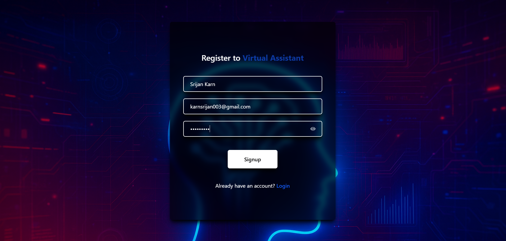
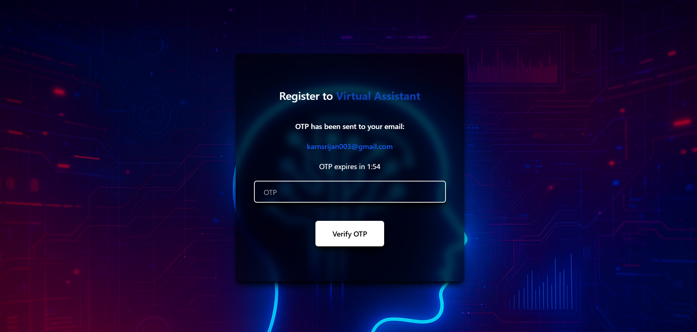
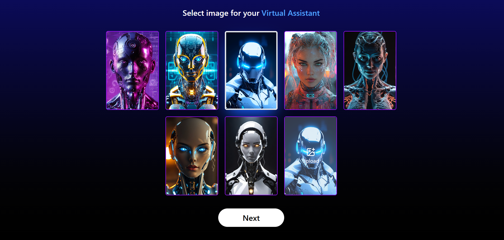
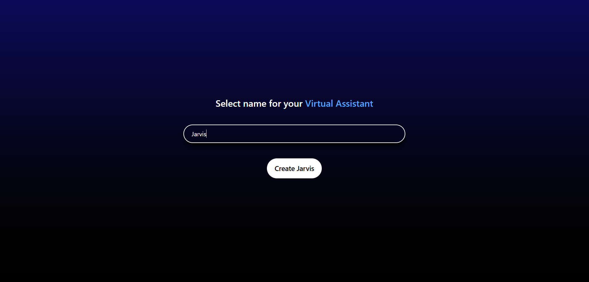
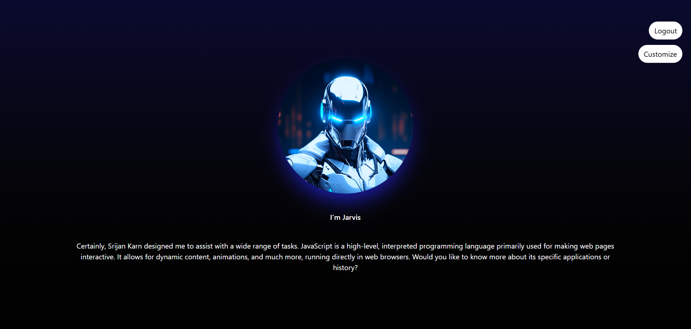

<h1>AI Virtual Assistant</h1>

A smart, general-purpose AI assistant built with the MERN stack, powered by the
Gemini LLM, featuring secure authentication, customizable assistant persona,
voice-based activation, and intelligent conversation history management.
Designed with production-grade engineering practices, it demonstrates mastery in
authentication flows, contextual AI systems, real-time voice and action
handling, and scalable backend architecture.

<h2>🧠 Table of Contents</h2>
<ul>
  <li>Overview</li>
  <li>Tech Stack</li>
  <li>Features</li>
  <li>Architecture</li>
  <li>Installation & Setup</li>
  <li>Environment Variables</li>
  <li>Future Enhancements</li>
  <li>Author</li>
  <li>License</li>
</ul>
<h2>🌍 Overview</h2>

The AI Virtual Assistant brings intelligent automation and conversational AI
into a clean, responsive web interface. Users can: Create accounts Verify
identity through a time-bound OTP Customize their assistant (name + image). Talk
to the assistant using voice, trigger small automated actions (Google
search, YouTube search, open social platforms). Explore AI-driven responses based
on the Gemini LLM. The project integrates AI, authentication, voice activation,
and a dynamic context builder to create a robust and production-ready personal
assistant experience.

<h2>⚙️ Tech Stack</h2>

<b>Frontend:</b>

<ul>
  <li>React.js</li>
  <li>Tailwind CSS</li>
  <li>Axios for API communication</li>
  <li>Voice capture utilities</li>
</ul>

<b>Backend:</b>

<ul>
  <li>Node.js + Express.js</li>
  <li>MongoDB + Mongoose</li>
  <li>JWT Authentication</li>
  <li>Nodemailer (Time-bound OTP system)</li>
  <li>Cloudinary for media storage</li>
</ul>

<b>AI & Utilities:</b>

<ul>
  <li>Gemini LLM api integration</li>
  <li>dotenv (Environment configuration)</li>
  <li>Middleware-driven request validation</li>
</ul>
<h2>💡 Features</h2>
<h3>🔐 User Authentication & Authorization</h3>
<ul>
  <li>Production-grade signup/login system secured by JWT >  </li>
  <li>Time-bound email OTP verification </li>
  <li>Complete error handling for nearly every edge case</li>
  <li>
    Protected routes to ensure only authorized users access critical pages
  </li>
</ul>
<h3>🧑‍🏫 Customizable User Assistant</h3>
<ul>
  <li>Upload or select assistant image (Cloudinary-integrated)</li>
  <li>Set assistant name    </li>
</ul>
<h3>🧠 AI Intelligence Layer</h3>
<ul>
  <li>Gemini LLM integrated for advanced reasoning and conversation</li>
  <li>Context Builder dynamically enhances AI understanding</li>
</ul>
<h3>🎙️ Voice-Based Agent Activation</h3>
<ul>
  <li>Hands-free voice trigger to activate the assistant(action required only once in the begining) </li>
  <li>
    Supports small action tasks such as:
    <ul>
      <li>Google Search</li>
      <li>YouTube Search</li>
      <li>Social media navigation</li>
    </ul>
  </li>
  <li>Handles general query conversations through voice </li>
</ul>
<h3>📱 Responsive UI</h3>
<ul>
  <li>Fully responsive across all screen sizes</li>
  <li>Smooth, clean interaction and layout</li>
</ul>

<h2>🛠️ Installation & Setup</h2>
<h3>1️⃣ Clone the Repository</h3>

git clone https://github.com/your-username/ai-virtual-assistant.git
 

cd ai-virtual-assistant

<h3>2️⃣ Install Backend Dependencies</h3>

cd backend
 

npm install

<h3>3️⃣ Install Frontend Dependencies</h3>

cd frontend
 

npm install

<h2>🔐 Environment Variables</h2>

<b>Create a <code>.env</code> file inside <code>/backend</code> with:</b>

PORT = select_your_port

MONGO_URI = select_your_mogo_uri

NODE_ENV = development

JWT_SECRET = write_your_jwt_secret

COMPANY_EMAIL = enter_your_emai

COMAPNY_EMAIL_PASS = enter_your_email_pass_key

CLOUDINARY_API_KEY = enter_your_cloudinary_api_key

CLOUDINARY_API_SECRET = enter_your_cloudinary_api_secret

CLOUDINARY_CLOUD_NAME = enter_your_cloudinary_cloud_name

GEMINI_URL = get_your_gemini_url

GEMINI_API_KEY = get_your_gemini_api_key

<h2>▶️ Run the Application</h2>
<h3>Start Backend</h3>
npm run dev

<h3>Start Frontend</h3>
npm run dev

<h2>🚀 Future Enhancements</h2>
<ul>
  <li>Multi-agent support</li>
  <li>Task automation dashboard</li>
  <li>Advanced voice-to-action mapping</li>
  <li>Memory-driven personalized responses</li>
</ul>
<h2>👨‍💻 Author</h2>
<b>Developed by: Srijan</b> 
<b>Role: Full Stack Developer (MERN + AI)</b> 
<b>LinkedIn: www.linkedin.com/in/srijan-karn-81507b27a</b> 
<b>GitHub: github.com/thrivingSec</b> 
<h2>🧾 License</h2>
<b
  >This project is licensed under the MIT License — open for personal and
  educational use.</b
>
